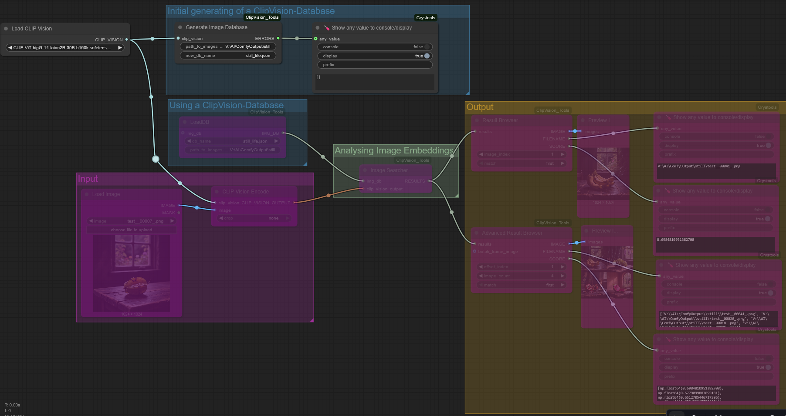
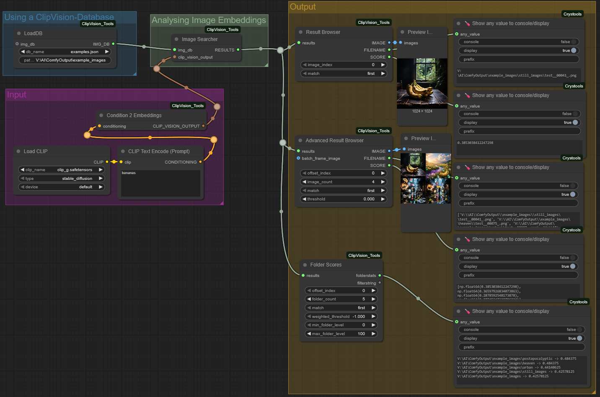

# ClipVision_Tools
Custom ComfyUI nodes using CLIP Vision models for image similarity analysis.

Based on [comfyUI-PL-data-tools](https://github.com/PnthrLeo/comfyUI-PL-data-tools) by PnthrLeo.

This repository provides several custom nodes for ComfyUI that enable efficient image similarity search and analysis using CLIP Vision models.

## Node Overview:


- ClipVision Database Nodes - Create and access small or large image collections (already tried with a collection up to ~100.000 images).
- Image Embedding Analysis Nodes - Search for similar imags within your collections using cosine-similarity.
- Output / Result-Browser - Browse through search results by "scrolling" up and down the image_index (depending on your direction of your match-setting).

## Before performing similarity searches, you first need to create a database for your image collection:

- Connected a "Load CLIP Vision" node and select a Clip Vision model. From my experience "CLIP-ViT-bigG-14-laion2B-39B-b160k" seems to work very well.
  [Download the Clip vision .safetensor-file into your ComfyUI "/models/clip_vision" folder](https://huggingface.co/axssel/IPAdapter_ClipVision_models/blob/main/CLIP-ViT-bigG-14-laion2B-39B-b160k.safetensors)
- path_to_images: Specify the full path to your image collection directory. All subfolders are scanned automatically.
- new_db_name: Choose a filename with the .json extension. The file will automatically be stored in your ComfyUI "/models/embDBs" folder.
- If you have Crystools installed, you can use the "Show any value to console/display" node to display a list of files that could not be recorded in the database (any other node capable of displaying text output works as well).

## After creating a database, you can search for similar images using a workflow like the one shown above:

- Load an image into a "CLIP Vision Encode" node, connected to a "Load CLIP Vision" node and select a ClipVision model. → This node generates the image embedding data of your input image.
- Pass this embedding data to the "Image Searcher" node, which calculates image similarities using a cosine similarity algorithm.
- "Result Browser": Browse the search results
  - image_index: Index of the image, depending on match direction.
  - match: "first" / "last" - "first" → image_index 0 outputs the most similar image. "last" → image_index 0 outputs the least similar image.
- "Advanced Result Browser": Similar to "Result Browser", but extended to output an image batch, all images scaled to resolution of "batch_frame_image" or resolution of the first image of the batch.
  - offset_index: see image_index of "Result Browser"
  - image_count: the amount of images to output as a image batch
  - match: see match of "Result Browser"

Additionally you can chain up multiple databases by using the optional "img_db" socket.
 → Please note, all databases need to be generated with the same ClipVision model

## You can directly compare the similarity of two images by connecting the outputs of two "CLIP Vision Encode" nodes to a "Compare Embeddings" node.

This node calculates the similarity as a factor between 0.0 and 1.0, which can be displayed using Crystools’ “Show any value to console/display” node or any similar output node.

## Using a "CLIP Text Encode" in combination with the experimental node "Condition 2 Embeddings" you can search through the database by text description.

 
 → Please note, not all CLIP text encoder models are compatible with all CLIP vision encoders. Please pay attention to the CLIP vision model with which you created the databse!
 I got very good results using the "clip_g" CLIP text encoder model in combination with "CLIP-ViT-bigG-14-laion2B-39B-b160k" CLIP vision model.

 You can check text and vision model compatibility using the "Embeddings Shape Info" node. Models with the same "shape" can be combined.

## Using a "CLIP Text Encode" and other experimental nodes enables you to search for images in combination with text.

 → Please note, this is a very experimental workflow! Results may vary due to the algorithms of the "Calculate Embeddings" node.
 In this case, the "Calculate Embeddings" node is set to "subtract". This causes the "green apples" embeddings to be reduced/removed from the image embeddings. This results in showing no images that include green apples. Hope you get the idea of how it should work in general.

## Manual install
```bash
# install latest version of ClipVision_Tools
cd Your_ComfyUI_Folder/ComfyUI/custom_nodes/
git clone https://github.com/MoonMoon82/ClipVision_Tools
cd ClipVision_Tools

# Install required python modules
Your_ComfyUI_Folder/python_embeded/python.exe -s -m pip install -r requirements.txt
```

## Dependencies:
Currently, only the orjson and pillow-heif Python modules are required.

## 🙏 Credits
Based on the original idea from [comfyUI-PL-data-tools](https://github.com/PnthrLeo/comfyUI-PL-data-tools) by PnthrLeo.
Extended and adapted by MoonMoon82 under the MIT License.
