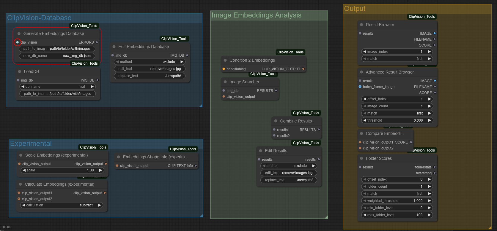

# ClipVision_Tools
Custom ComfyUI nodes using CLIP Vision models for image similarity analysis.

Based on [comfyUI-PL-data-tools](https://github.com/PnthrLeo/comfyUI-PL-data-tools) by PnthrLeo.

This repository provides several custom nodes for ComfyUI that enable efficient image similarity search and analysis using CLIP Vision models.

## Node Overview:


- ClipVision Database Nodes - Create and access small or large image collections (already tried with a collection up to ~100.000 images).
- Image Embedding Analysis Nodes - Search for similar imags within your collections using cosine-similarity.
- Output / Result-Browser - Browse through search results by "scrolling" up and down the image_index (depending on your direction of your match-setting).

## Before performing similarity searches, you first need to create a database for your image collection:

- Connected a "Load CLIP Vision" node and select a Clip Vision model. From my experience "CLIP-ViT-bigG-14-laion2B-39B-b160k" seems to work very well.
  [Download the Clip vision .safetensor-file into your ComfyUI "/models/clip_vision" folder](https://huggingface.co/axssel/IPAdapter_ClipVision_models/blob/main/CLIP-ViT-bigG-14-laion2B-39B-b160k.safetensors)
- path_to_images: Specify the full path to your image directory. All subfolders are scanned automatically.
- new_db_name: Choose a filename with the .json extension. The file will automatically be stored in your ComfyUI "/models/embDBs" folder.
- If you have Crystools installed, you can use the "Show any value to console/display" node to display a list of files that could not be recorded in the database (any other node capable of displaying text output works as well).

## After creating a database, you can search for similar images using a workflow like the one shown above:

- Load an image into the Get Image Embeddings node, connected to a "Load CLIP Vision" node and select a Clip Vision model. → This node generates the embedding data of your input image.
- Pass this embedding data to the "Image Searcher" node, which calculates image similarities using a cosine similarity algorithm.
- Browse the search results with the "Result Browser" node:
  - image_index: Index of the image, depending on match direction.
  - match: "first" / "last" - "first" → image_index 0 outputs the most similar image. "last" → image_index 0 outputs the least similar image.

## You can directly compare the similarity of two images by connecting the outputs of two "Get Image Embeddings" nodes to a "Compare Embeddings" node.

This node calculates the similarity as a factor between 0.0 and 1.0, which can be displayed using Crystools’ “Show any value to console/display” node or any similar output node.

## Manual install
```bash
# install latest version of ClipVision_Tools
cd Your_ComfyUI_Folder/ComfyUI/custom_nodes/
git clone https://github.com/MoonMoon82/ClipVision_Tools
cd ClipVision_Tools

# Install required python modules
Your_ComfyUI_Folder/python_embeded/python.exe -s -m pip install -r requirements.txt
```

## Dependencies:
Currently, only the orjson Python module is required.

## 🙏 Credits
Based on the original idea from [comfyUI-PL-data-tools](https://github.com/PnthrLeo/comfyUI-PL-data-tools) by PnthrLeo.
Extended and adapted by MoonMoon82 under the MIT License.
